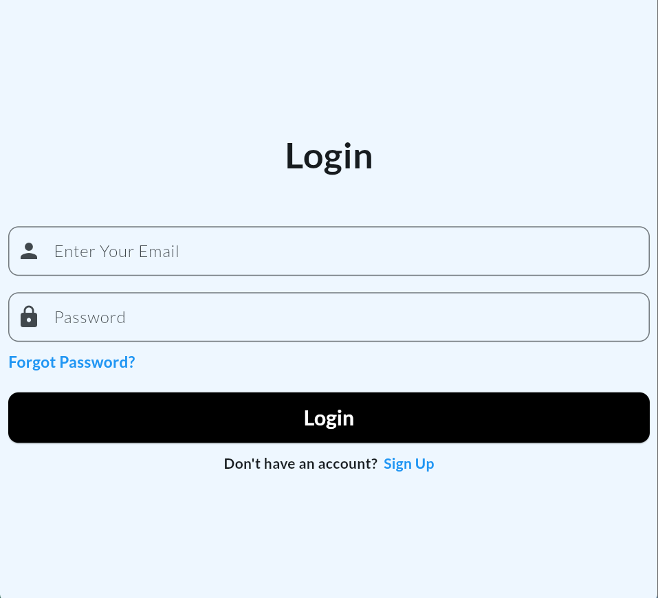
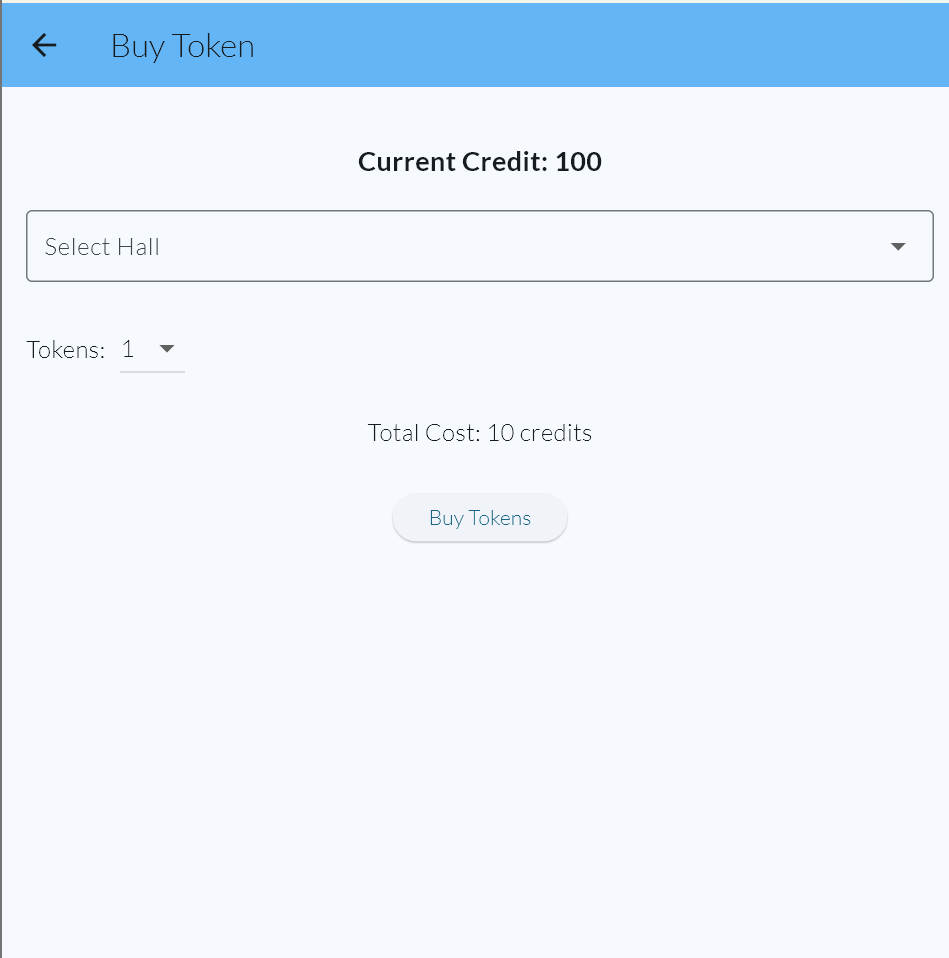
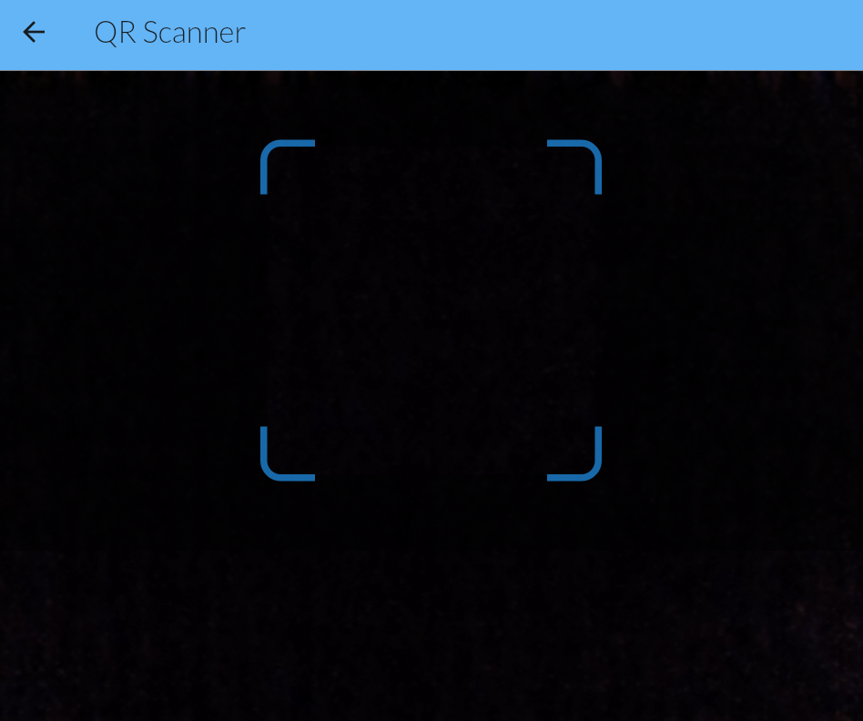
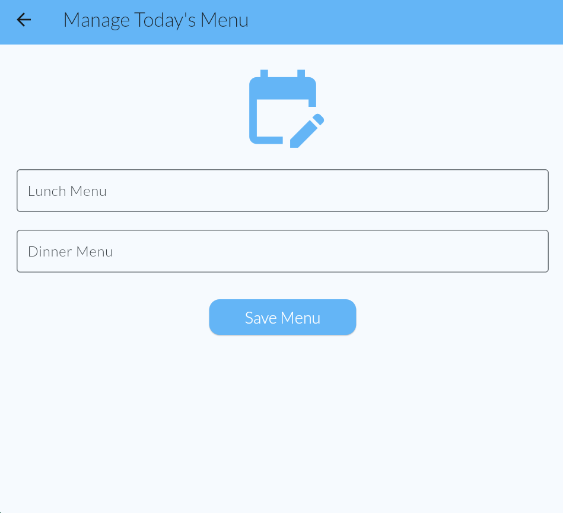
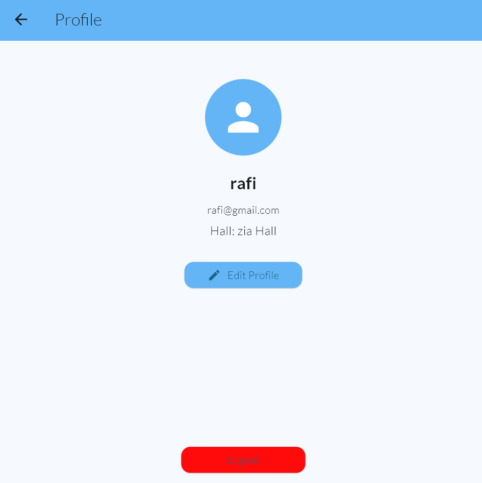

# Hall Dining Management

## Description
Hall Dining Management is a cross-platform Flutter application designed to manage dining hall operations for students and administrators. It provides features for token management, menu viewing, user profile management, and more.

## Features
- User authentication (login, sign up, forgot password)
- Buy meal tokens and view available credits
- Use tokens via QR code scanning (with time restrictions)
- View today's food menu
- Edit user profile
- View scan logs
- Admin dashboard (manage menu, view dining stats, user management)
- Dark mode toggle
- Logout functionality

## Installation Instructions
1. Ensure you have [Flutter SDK](https://docs.flutter.dev/get-started/install) installed (version 3.7.0 or higher).
2. Clone this repository:
   ```powershell
   git clone https://github.com/rafi2203164/hall-dining-management.git
   cd hall_dining_management
   ```
3. Install dependencies:
   ```powershell
   flutter pub get
   ```
4. Run the app:
   ```powershell
   flutter run
   ```
   - For Windows: `flutter run -d windows`
   - For Android: `flutter run -d android`
   - For Web: `flutter run -d chrome`

## Versions Used
- Flutter SDK: ^3.7.0
- provider: ^6.1.1
- cupertino_icons: ^1.0.8
- intl: ^0.20.2
- qr_code_scanner: ^1.0.1
- sqflite: ^2.3.0
- path: ^1.8.3

## Feature Explanations

### 1. User Authentication
Users can sign up, log in, and reset their password. Credentials are validated and navigation is handled based on user type (admin or regular user).

### 2. Buy Tokens
Users can purchase meal tokens using available credits. The UI allows selection of hall and number of tokens, and displays the total cost.

### 3. Use Tokens (QR Scanner)
Tokens are used by scanning a QR code. Usage is restricted to lunch (1–3 PM) and dinner (8–10 PM) times. The app decrements tokens and provides feedback.

### 4. Food Menu
Displays today's lunch and dinner menu, fetched from the local database.

### 5. Edit Profile
Users can update their name, email, and hall information.

### 6. Scan Logs
Shows a list of previous token scans with time and meal type.

### 7. Admin Dashboard
Admins can manage the menu, view dining statistics, and manage users.

### 8. Dark Mode
Toggle between light and dark themes for better accessibility.

### 9. Logout
Securely log out and return to the login screen.

## Screenshots








---
